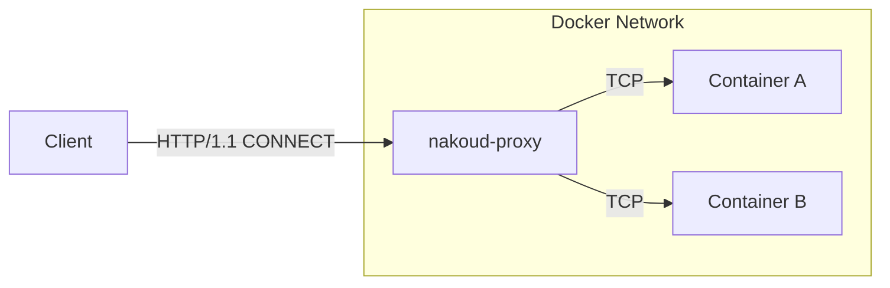

# nakoud

Access your Docker containers easily without port forwarding



## Getting Started

### Run the proxy

The nakoud proxy works as a HTTP proxy, to accept connections from your client.
This will be the entrypoint of all connections to Docker containers, instead of port forwarding.

```shell
docker network create nakoud
docker run \
    -p '127.0.0.1:8080:8080/tcp' \
    -p '[::1]:8080:8080/tcp' \
    -v '/var/run/docker.sock:/var/run/docker.sock:z' \
    --network nakoud \
    ghcr.io/siketyan/nakoud:latest
```

### Run your application

You don't need port forwarding your application from now.
To access through nakoud, run your application in the nakoud network, with a label to specify the FQDN to access using.

```shell
docker run \
    # No port forwarding (-p) is needed :)
    --network nakoud \
    --label 'jp.s6n.nakoud.fqdn=nginx.nakoud.local' \
    nginx:latest
```

### Test the connection

Use telnet or some TCP client to test the connection.

```shell
telnet localhost:8080
```
Once you connected to the nakoud proxy, type these to request `/` from nginx (`+` is what your type, `-` is what you receive):

```diff
+ CONNECT nginx.nakoud.local:80 HTTP/1.1
+
- HTTP/1.1 200 OK
- Content-Length: 0
-
+ GET / HTTP/1.1
+ Host: nakoud.nginx.local
+
- HTTP/1.1 200 OK
- Server: nginx/1.23.4
- Date: Sat, 29 Apr 2023 07:55:11 GMT
- Content-Type: text/html
- Content-Length: 615
- Last-Modified: Tue, 28 Mar 2023 15:01:54 GMT
- Connection: keep-alive
- ETag: "64230162-267"
- Accept-Ranges: bytes
- 
- <!DOCTYPE html>
- <html>
- ...(truncated)
```

Welcome to nakoud!

## Roadmap

There are more things to do:

- [x] Other HTTP methods support than CONNECT method\
- [ ] Intermediate TLS certificate
- [ ] Automatic FQDN without labeling (`<container>.nakoud.local` or something)
- [ ] Docker Compose support (`<service>.<project>.nakoud.local` or something)
- [ ] HTTPS, SOCKS proxy

... and more!

If you have an idea to improve nakoud, please file at [Issues](https://github.com/siketyan/nakoud/issues).

## FAQ

### What is "nakoud" from?

"nakoud" is originally from "nakoudo" which means a matchmaker in Japanese.
The nakoud proxy receives a request from your client and intermediate it through Docker network.
It looks like a matchmaker, and also it is a daemon; typically daemons are named with "d" suffix, so we named this "nakoud".
